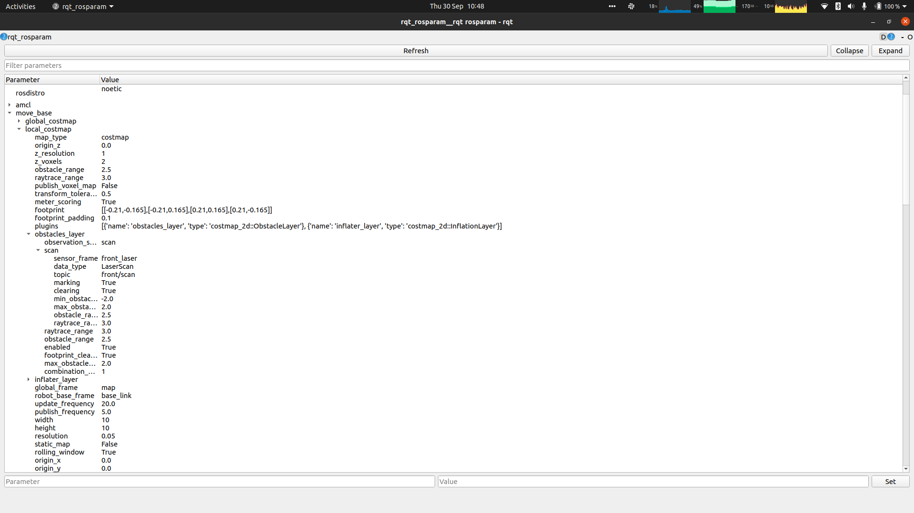

# rqt_rosparam

View, edit and add parameters from a GUI.

To start, you will need to have a roscore running. Then, run

```bash
rosrun rqt_rosparam rqt_rosparam
```

You will see a GUI something like



You can add new parameters to the rosparam server by using the `Set` button and text boxes at the bottom.

Using the text box at the top you can filter the parameters in the server.

Double clicking in the value column and editing the value will set that parameter on the server.

The interface does not automatically refresh parameters - if you have started some new nodes, you will need to click the refresh button to display the most up to date parameter values.